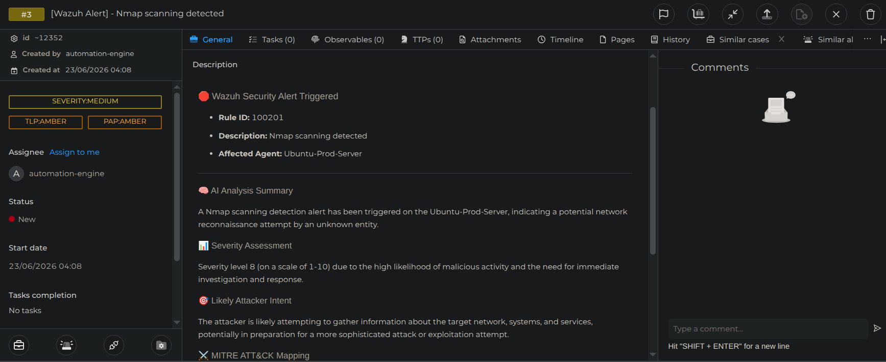
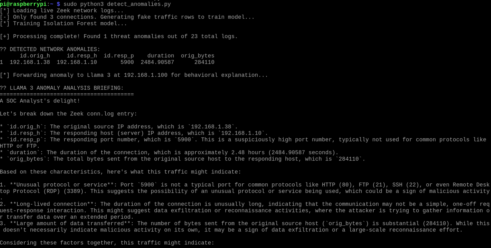
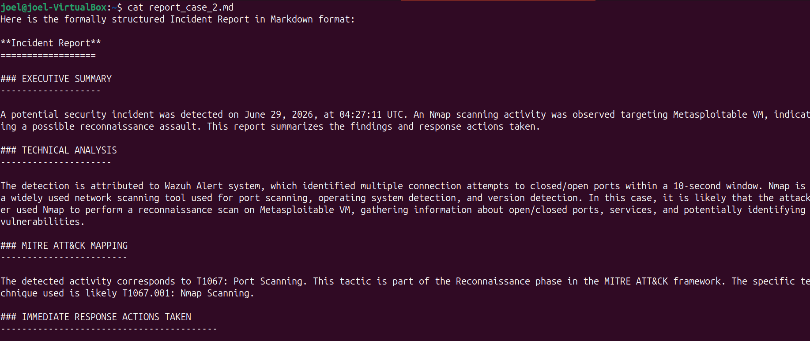

# Home SOC Lab

> A fully functional Security Operations Centre built on a main PC and Raspberry Pi using 100% free and open-source tools.

---

## Overview

This project is a home Security Operations Centre (SOC) lab built to gain practical, hands-on experience with security monitoring, detection engineering, and incident response. The setup splits workloads between a host virtual machine network on my main PC and a physical Raspberry Pi serving as a dedicated network sensor. Together, they create a functional pipeline that captures, processes, and triages live network telemetry. Building this lab allowed me to practice deploying a central SIEM, writing custom signature and behavioral detection rules, automating alert workflows via SOAR, and testing privacy-preserving local AI triage agents.

---

## Architecture

| Device | Role | Real Network | Lab Network |
|--------|------|--------------|-------------|
| Main PC (Ubuntu VM) | SIEM, IR Platform, AI | 192.168.1.100 | 192.168.100.10 |
| Raspberry Pi 5 | Network Sensor, IDS, NSM, Honeypot, Log Shipper | 192.168.1.10 | NA |
| Attack VM | Simulated target (Metasploitable 2) | NA | 192.168.100.20 |

---

## Tools & Their Purpose

| Tool | Category | Purpose |
|------|----------|---------|
| **Wazuh Manager** | SIEM | The central brain of the lab; correlates telemetry from network agents and runs File Integrity Monitoring (FIM). |
| **Wazuh Indexer & Dashboard** | Log Storage & Web UI | The dedicated database and interface layer; stores and indexes normalized security events and powers the visual dashboards. |
| **Suricata** | IDS | Signature-based Intrusion Detection System running in promiscuous mode on the Pi to fire alert telemetry on known exploit payloads and scans. |
| **Zeek** | NSM | Behavioral Network Security Monitor; strips raw packets into protocol-specific, forensic metadata streams (`conn.log`, `dns.log`, `http.log`). |
| **Cowrie** | Honeypot | SSH/Telnet medium-interaction honeypot used to lure brute-force attackers into a sandboxed environment and capture raw operational tooling. |
| **TheHive** | Incident Response | Central case management platform used to track incident lifecycles, assign tasks, and ingest automated investigative evidence. |
| **Ollama + Llama 3** | AI/ML | Privacy-preserving local LLM framework running an 8B model to perform automated, context-aware alert analysis without cloud exposure. |
| **scikit-learn** | ML | Python-driven statistical analytics layer running an unsupervised *Isolation Forest* model to catch abnormal network traffic spikes. |

---

## What I Built

Traffic on the Raspberry Pi sensor interface is captured in real time by Suricata and Zeek. Suricata flags known threat signatures to generate alerts, while Zeek records detailed network traffic metadata (like connection lengths and protocols) for forensic context. These logs, along with interaction data from the containerized Cowrie honeypot, are collected by Filebeat and shipped to the Wazuh Manager running inside Docker on my main PC. Once ingested, Wazuh correlates the telemetry against its standard rulesets and active File Integrity Monitoring (FIM) configurations. High-severity alerts are then funneled into a custom Python script that queries AbuseIPDB for reputation data and prompts a local Ollama pipeline (running Llama 3) to generate an immediate threat triage summary, which is sent directly into TheHive for analysis.

---

## Key Features

- **Privacy-Preserving Local AI Triage:** Integrates a local 8B Llama 3 model via Ollama to analyze raw JSON alerts and write clear triage summaries without sending sensitive network logs to public cloud APIs.
- **Dual-Engine Network Monitoring:** Combines signature-based threat alerts (Suricata) with behavioral network logging (Zeek) to provide full visibility into network activity.
- **Isolated Honeypot Environment:** Runs a containerized Cowrie honeypot under a restricted, unprivileged user profile with firewall rules to safely record attacker keystrokes and session inputs.
- **Targeted Host Auditing:** Implements custom File Integrity Monitoring (FIM) via Wazuh to track unauthorized changes across critical system directories (`/etc`, `/bin`, `/boot`).

---

## Challenges & How I Solved Them

### 1. Filebeat Compatibility and Ingestion Failure
* **The Problem:** The Filebeat agent on the Raspberry Pi kept crashing (`status=1/FAILURE`) and failing to ship logs to the main SIEM.
* **The Diagnosis:** The issue was two-fold: a minor formatting issue (indentation error) on line 19 of `filebeat.yml` broke the configuration parser, and using the standard Elastic-licensed version of Filebeat caused a licensing conflict with the open-source Wazuh Indexer.
* **The Fix:** Removed the standard Elastic binary from the Pi. Corrected the spacing in the YAML configuration file and manually installed the official open-source distribution package (`filebeat_7.10.2_arm64.deb`) provided by Wazuh to allow clean ingestion.

### 2. Zeek Process Conflicts and Missing Logs
* **The Problem:** Wazuh reported missing log files for Zeek, and running `zeekctl status` showed that the network monitoring engine had stopped working.
* **The Diagnosis:** I checked active processes using `ps` and found that running manual debugging tests directly via raw binary commands (`sudo zeek -i eth0`) created a conflict with the background service. This forced the active log files to dump into the user home folder instead of the expected system log directory.
* **The Fix:** Used `sudo pkill -f /opt/zeek/bin/zeek` to stop all conflicting background processes, cleared the stale system locks, and restarted the engine properly using the formal `zeekctl` control tool.

### 3. Wazuh Indexer Container Boot Loop
* **The Problem:** During the initial setup of the core server platform, the primary database container repeatedly crashed on startup.
* **The Diagnosis:** Checking the container logs showed a fatal resource limitation error: `max virtual memory areas vm.max_map_count [65530] is too low, increase to at least [262144]`. The host operating system's default memory configuration was too low for the database engine.
* **The Fix:** Permanently increased the host machine's virtual memory capabilities by adding `vm.max_map_count=262144` to `/etc/sysctl.conf` and applied the change instantly using `sudo sysctl -p`.

---

## Skills Demonstrated

- **SIEM Configuration & Log Collection:** Setting up log collection paths, troubleshooting agent-to-manager network communication, and managing structured log ingestion.
- **Network Security Monitoring:** Writing custom signature alerts in Suricata, tracking network metadata through Zeek logs, and setting up network interfaces for packet capture.
- **Incident Response Basics:** Managing incident workflows, creating documented security cases, and tracking attack evidence within a ticketing platform.
- **System Hardening & Network Control:** Configuring host-level firewalls (UFW), managing network subnets for virtual machines, and implementing standard system user permissions.

---

## Incident Reports

| Report | Attack Type | Severity | Date |
|--------|------------|----------|------|
| [IR-001](reports/IR-001-nmap-scan.md) | Nmap Port Scan / Reconnaissance | Medium | 04-05-2026 |
| [IR-002](reports/IR-002-ssh-brute.md) | SSH Brute Force Attack | High | 15-05-2026 |
| [IR-003](reports/IR-003-honeypot-compromise.md) | Honeypot Interaction / Compromise | High | 06-06-2026 |
| [IR-004](reports/IR-004-gobuster.md) | Gobuster Directory Brute Force | Medium | 18-06-2026 |

---

## Lessons Learned

See [lessons-learned.md](lessons-learned.md) for the full log of technical challenges, design choices, and key takeaways from building this project.

---

## Screenshots

### 1. Automated Alert Triage & TheHive Integration
When a high-severity alert triggers, the custom triage script automatically passes the payload to the local Llama 3 model and opens an enriched case file directly inside TheHive case manager, complete with AI-generated attacker intent and severity assessments.

### 2. Network Anomaly Detection (ML + AI Pipeline)
Running on the Raspberry Pi sensor, this script trains an unsupervised Isolation Forest model on raw Zeek logs to pick out behavioral outliers (like an unusually long active connection). The anomaly data is then handed off to Llama 3 for a localized plain-text explanation.

### 3. Automated Incident Report Generation
To save manual reporting time, this script pulls closed case data from the database and uses the local LLM to draft a structured, markdown-formatted formal Incident Report, including executive summaries and MITRE ATT&CK mapping.

---

## Author

**Joel V Saju**  