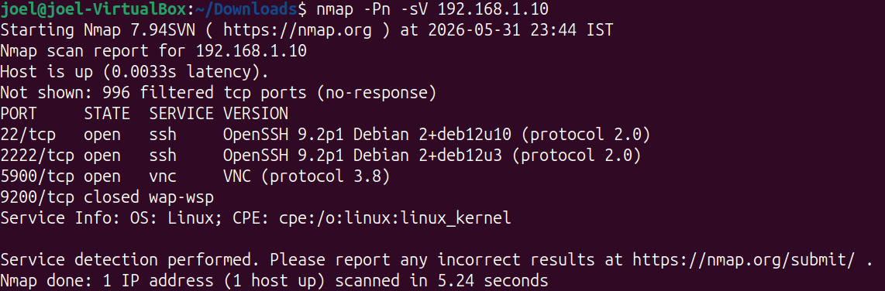
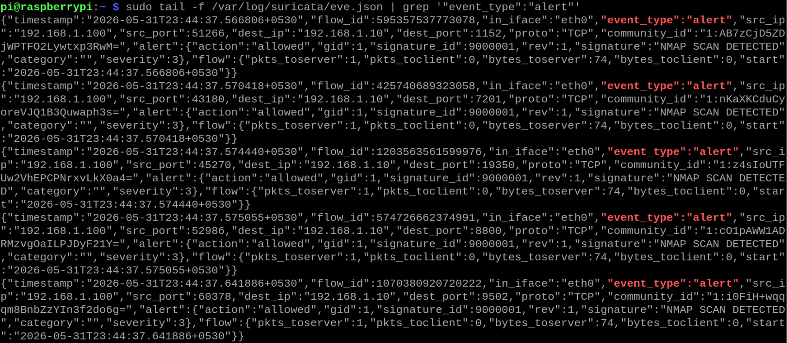
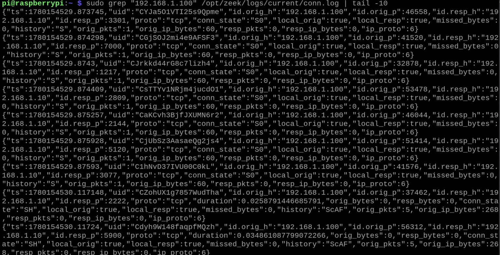
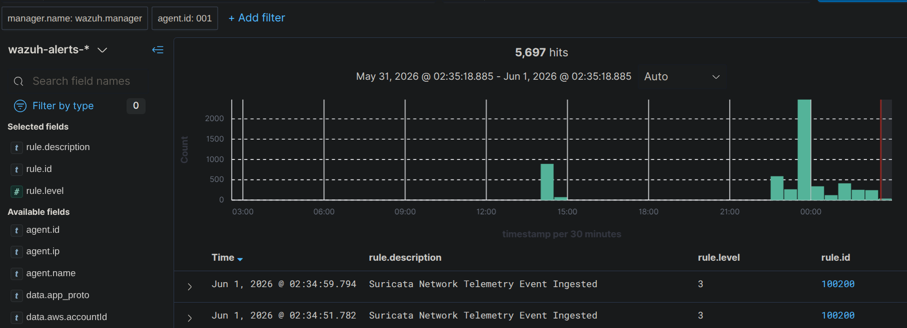
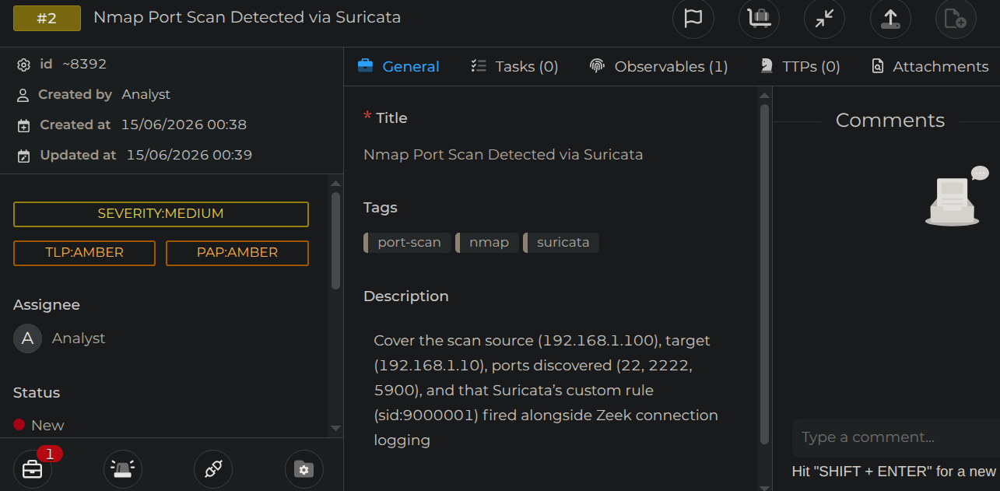

# Incident Report — IR-001

| Field | Details |
|-------|---------|
| **Report ID** | IR-001 |
| **Date** | 31-05-2026 |
| **Analyst** | Joel |
| **Severity** | Medium |
| **Status** | Closed |
| **Attack Type** | Network Reconnaissance (Port Scan) |
| **Detection Source** | Suricata IDS / Zeek Telemetry / Wazuh SIEM |

---

## Executive Summary

On May 31, 2026, an active network reconnaissance scan was detected targeting the core host environment (`192.168.1.10`). The scan originated from an internal staging IP (`192.168.1.100`) and actively probed for open network services using service version detection flags. The activity triggered immediate custom alert signatures on the Suricata IDS engine, generated concurrent anomalous traffic logs within Zeek, and was successfully aggregated as a high-volume event surge inside the Wazuh dashboard before being logged as an investigation case. No system compromise occurred, as the activity was limited strictly to pre-attack reconnaissance.

---

## Timeline of Events

| Time (IST) | Event |
|------|-------|
| 23:44:32 | Attacker executes aggressive Nmap service detection scan (`-Pn -sV`) against target IP `192.168.1.10`. |
| 23:44:37 | Suricata IDS captures the traffic bursts and fires multiple alerts for custom signature ID `9000001` (NMAP SCAN DETECTED). |
| 23:44:37 | Zeek behavioral monitoring logs a rapid sequence of connection attempts (`conn.log`) across high ephemeral ports to the target. |
| 23:45:00 | Wazuh SIEM ingests the telemetry pipeline surge, matching rule ID `100200` (Suricata Network Telemetry Event Ingested). |
| 00:38:00 | Incident is formally escalated and logged within TheHive case management platform (`Case ID: ~8392`) for analyst closure. |

---

## Technical Analysis

The incident involved active network reconnaissance using Nmap. Telemetry analysis shows the attacker utilized the `-Pn` (skip host discovery) and `-sV` (service version intensity scanning) parameters to probe for active listeners on target host `192.168.1.10`. 

The scan successfully discovered three open entry points:
* **Port 22/tcp:** OpenSSH 9.2p1 Debian 2+deb12u10
* **Port 2222/tcp:** OpenSSH 9.2p1 Debian 2+deb12u3
* **Port 5900/tcp:** VNC service protocol

### Detection Engineering Breakdown
1. **Suricata Pipeline:** The signature engine matched the rapid multi-port TCP profiling attempts against its local network rules, writing structured alert instances to `/var/log/suricata/eve.json` containing the specific classification tag `NMAP SCAN DETECTED`.
2. **Zeek Pipeline:** Simultaneously, the Zeek daemon recorded connection records exhibiting a state connection string of `S0` (Connection attempt seen, no reply packet caught), proving inbound service enumeration attempts across multiple destination ports (e.g., 3301, 7000, 1217, 2809).
3. **SIEM Ingestion:** The log shippers forwarded the output to the central manager. Due to the rapid multi-port interrogation style of Nmap, a significant processing hit of over 5,600 events was observed on the dashboard timeline during the exact scanning window.

---

## Indicators of Compromise (IOCs)

| Type | Value | Notes |
|------|-------|-------|
| Source IP | `192.168.1.100` | Internal network host executing scanning scripts. |
| Target IP | `192.168.1.10` | Destination system under active enumeration. |
| Tool Identified | Nmap 7.94SVN | Confirmed via specific multi-port connection flow signatures and scan structure. |
| Target Ports | 22, 2222, 5900, 9200 | Ports interrogated for active service banners. |

---

## MITRE ATT&CK Mapping

| Technique ID | Technique Name | Notes |
|-------------|----------------|-------|
| T1595.001 | Active Scanning: IP Addresses | Scanning the network block to find live endpoints. |
| T1046 | Network Service Scanning | Probing specific ports (22, 2222, 5900) to find active services and software versions. |

---

## Detection Details

**Alert fired by:** Suricata / Wazuh Manager  
**Rule ID:** 100200 (Wazuh SIEM Ingestion) / 9000001 (Suricata Alert Signature)  
**Rule description:** Suricata Network Telemetry Event Ingested: NMAP SCAN DETECTED  
**Alert level:** Level 3 (Aggregated to Medium Severity on escalation)  
**Detected at:** 2026-05-31 23:44:37 +0530  

---

## Response Actions Taken

1. **Telemetry Verification:** Carved out raw log entries from both the network sensor (`/opt/zeek/logs/current/conn.log`) and IDS (`/var/log/suricata/eve.json`) to confirm the alert volume wasn't a false positive system sync.
2. **Attack Surface Check:** Verified the exposed service versions identified by Nmap to ensure no legacy, unpatched vulnerabilities were visible on ports 22, 2222, or 5900.
3. **Case Management Lifecycle:** Documented the findings, mapped the attacker intent, and logged the complete investigative chain of evidence as a closed ticket within TheHive tracking platform.

---

## Root Cause

The host interface was intentionally configured to accept broad local connection queries to validate threat detection signatures and verify the network monitoring visibility of the deployment architecture.

---

## Recommendations

1. **Deploy Network Throttling:** Implement rate-limiting rules via iptables or system firewalls to automatically drop source IPs that trigger a high threshold of concurrent connection attempts across diverse ports within a short time window.
2. **Service Hardening:** Ensure the VNC service running on port 5900 is locked down behind local loopback access or requires an authenticated tunnel rather than listening broadly on open host ports.
3. **Tune SIEM Alert Thresholds:** Configure a specific Wazuh threshold rule to auto-escalate low-level network telemetry events (Level 3) to an actionable alert level if an identical source IP generates more than 100 hits in under 10 seconds.

---

## Evidence

### 1. Attacker Reconnaissance Execution
Execution of the aggressive service-detection port scan targeting the network sensor interface.

### 2. Suricata IDS Alert Ingestion
Raw `eve.json` logs on the network sensor showing Suricata generating real-time alert triggers (`signature_id: 9000001`) for the ongoing Nmap scan.

### 3. Zeek Behavioral Network Telemetry
Raw connection records (`conn.log`) on the Raspberry Pi logging concurrent, rapid connection attempts across diverse high ports from the source IP address.

### 4. SIEM Alert Aggregation
The Wazuh Dashboard logging an immediate data surge of over 5,000 ingested events corresponding directly to the timeframe of the active scanning window.

### 5. Incident Logged in Case Management
The final incident escalation ticket successfully generated and assigned within TheHive dashboard for analyst remediation tracking.

---

*Report written by: Joel*  
*Review date: 02-06-2026* 
