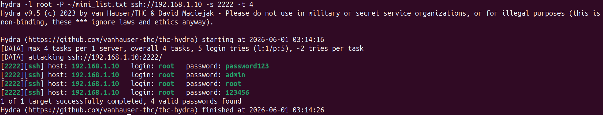
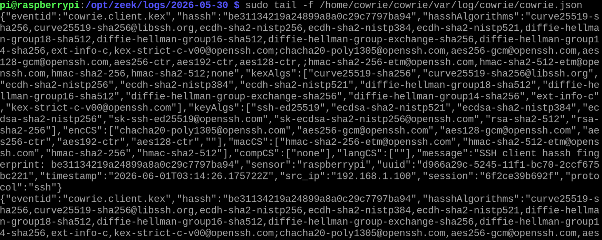
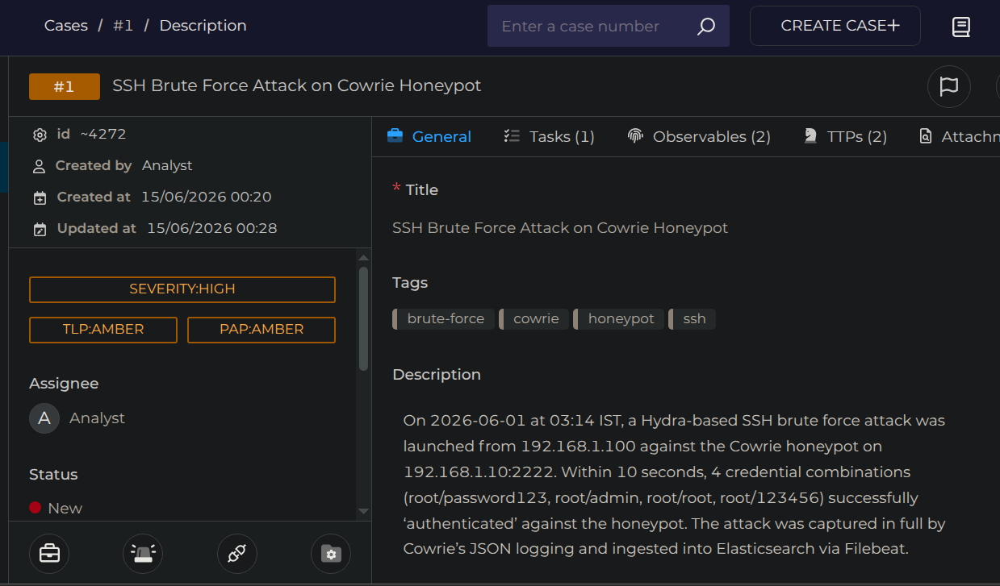

# Incident Report — IR-002

| Field | Details |
|-------|---------|
| **Report ID** | IR-002 |
| **Date** | 01-06-2026 |
| **Analyst** | Joel |
| **Severity** | High |
| **Status** | Closed |
| **Attack Type** | Credential Access (SSH Brute Force) |
| **Detection Source** | Cowrie Honeypot / Zeek Telemetry / Elastic Stack |

---

## Executive Summary

On June 1, 2026, an automated SSH brute force attack was directed at the internal host environment (`192.168.1.10`) targeting port `2222`. The attack originated from an internal staging IP (`192.168.1.100`) utilizing Hydra to conduct rapid dictionary password-guessing attempts. The malicious interaction was intercepted in real time by an isolated Cowrie honeypot system, which logged four successful mock authentication entries over a 10-second window. Telemetry data was captured via the sensor's file backend and ingested into the central SIEM and case management stack, showing zero disruption or actual system compromise due to the sandbox deployment layout.

---

## Timeline of Events

| Time (IST) | Event |
|------|-------|
| 03:14:16 | Attacker launches automated dictionary attack via Hydra (`hydra -l root -P mini_list.txt`) targeting SSH services on `192.168.1.10:2222`. |
| 03:14:26 | Hydra attack cycle finishes within 10 seconds, successfully harvesting 4 vulnerable mock credentials from the honeypot application framework. |
| 03:14:26 | Cowrie honeypot records the inbound client key exchange protocol (`cowrie.client.kex`) and extracts the precise client HASSH fingerprint string. |
| 00:20:00 | Incident logging validation triggers case creation inside TheHive platform, logging the event as `Case ID: ~4272` with High severity parameters. |

---

## Technical Analysis

The security incident involved an aggressive, high-speed credential enumeration attempt targeting alternative SSH connection paths. The attacker targeted port `2222` using Hydra v9.5 with high thread execution flags (`-t 4`) to parse an identity list against root credentials.

Because port `2222` was pre-configured to host a Cowrie honeypot service, the script encountered an emulated interaction wrapper. The tool successfully identified 4 dictionary password strings matching its check rules:
* `root/password123`
* `root/admin`
* `root/root`
* `root/123456`

### Forensics & Threat Intelligence Extraction
1. **Honeypot Session Interception:** The target did not drop the connection attempts. Instead, it logged structured event metrics to `/home/cowrie/cowrie/var/log/cowrie/cowrie.json`.
2. **Cryptographic Client Profiling:** The log ingestion pipeline isolated the client key exchange profile to generate an SSH client HASH fingerprint value: `be3134219a24899a8a0c29c7797ba94`. This string allows analysts to fingerprint the signature profile of the attacking client tool independent of user-agent or IP modification tricks.
3. **Data Ingestion Stream:** The active event logs were processed by Filebeat log-forwarding components and pushed directly to the centralized SIEM layer for behavioral analysis.

---

## Indicators of Compromise (IOCs)

| Type | Value | Notes |
|------|-------|-------|
| Source IP | `192.168.1.100` | Staging host node running automated scanning binaries. |
| Target IP | `192.168.1.10` | Destination lab host serving honeypot socket configurations. |
| Target Port | `2222` | Emulated non-standard SSH service port. |
| HASH Fingerprint | `be3134219a24899a8a0c29c7797ba94` | Specific cryptographic fingerprint generated by the Hydra client application. |
| Weaponization Tool | Hydra v9.5 | Identified via execution sequencing and short 10-second delivery windows. |

---

## MITRE ATT&CK Mapping

| Technique ID | Technique Name | Notes |
|-------------|----------------|-------|
| T1110.001 | Brute Force: Password Guessing | Running automated lists against targeted system accounts to find access routes. |
| T1046 | Network Service Discovery | Profiling external target service configurations to check for active authentication methods. |

---

## Detection Details

**Alert fired by:** Cowrie Honeypot Engine / Filebeat Monitor  
**Log Path:** `/home/cowrie/cowrie/var/log/cowrie/cowrie.json`  
**Event ID Focus:** `cowrie.client.kex` (SSH Client Key Exchange initialization)  
**Assigned Impact:** High Severity (Escalated due to multi-login credential validation rates)  
**Detected at:** 2026-06-01 03:14:26 UTC  

---

## Response Actions Taken

1. **Log Data Extraction:** Collected raw JSON entries using `tail` filters over the core honeypot environment to document exact credential targets.
2. **Isolation Verification:** Verified the active integrity parameters of the container application shell to verify the automated attack script didn't breakout into the parent Raspberry Pi filesystem layers.
3. **Case Escalation Tracking:** Pushed incident telemetry into TheHive interface under `Case ID: ~4272` to complete target documentation metrics.

---

## Root Cause

The honeypot application framework was deliberately deployed to listen across common secondary SSH vectors (port 2222) to trace automated credential scanning trends within internal infrastructure perimeters.

---

## Recommendations

1. **Implement Firewall Drop Rules:** Deploy local Fail2ban filters or iptables drop rules to block source IPs that trigger more than 3 failed authentication entries within a rolling 60-second window.
2. **Enforce Key Token Profiles:** Disable plaintext password connection methods across production system setups, requiring cryptographic key configuration setups (`AuthorizedKeysFile`) for remote logins.
3. **Reposition Honeypot Endpoints:** Keep honeypots running on distinct, non-production asset blocks to separate decoy event streams from normal management interface baselines.

---

## Evidence

### 1. Attacker Dictionary Brute Force Execution
The attacker execution sequence running Hydra against the target socket port to test common password combinations.

### 2. Cowrie JSON Telemetry Log Stream
Raw `cowrie.json` network sensor log events capturing the active client key exchange metadata and the HASH fingerprint footprint.

### 3. Case Managed Lifecycle Verification
The incident record generated inside TheHive tracking interface outlining the extracted attack paths and target criteria.

---

*Report written by: Joel*  
*Review date: 05-06-2026*
