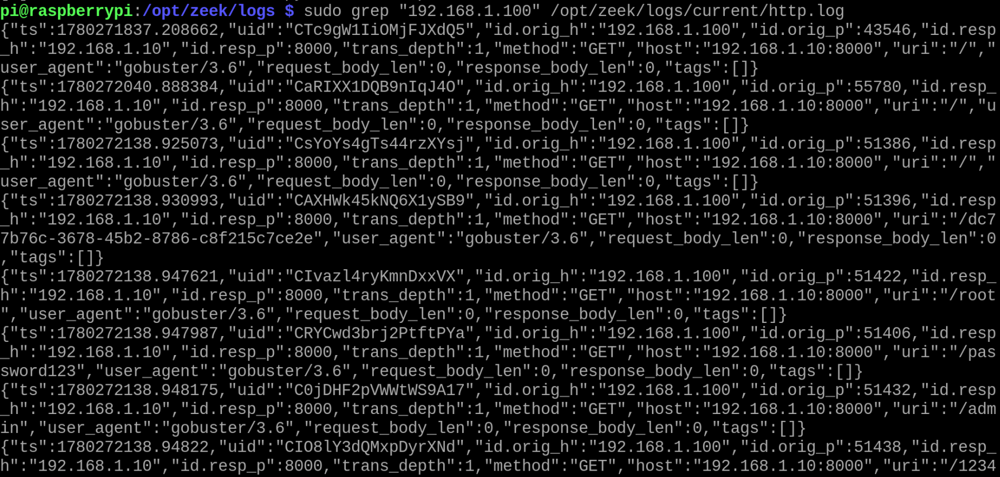
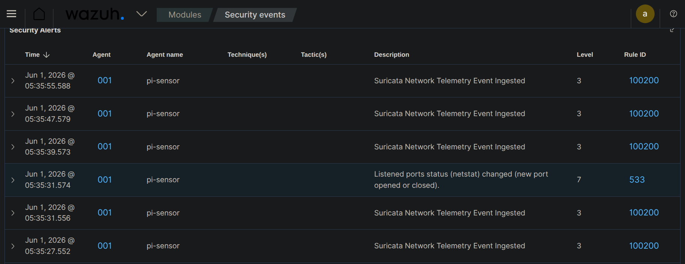

# Incident Report — IR-004

| Field | Details |
|-------|---------|
| **Report ID** | IR-004 |
| **Date** | 01-06-2026 |
| **Analyst** | Joel |
| **Severity** | Medium |
| **Status** | Closed |
| **Attack Type** | Web Directory Brute Force (Directory Discovery) |
| **Detection Source** | Zeek HTTP Telemetry / Suricata IDS / Wazuh SIEM |

---

## Executive Summary

On June 1, 2026, an automated web directory enumeration attack was detected targeting a local service listening on port `8000` of the host environment (`192.168.1.10`). The activity originated from internal host `192.168.1.100` utilizing the directory brute-forcing tool Gobuster. The attack generated a high frequency of rapid HTTP `GET` requests targeting hidden directories and common resource names. The anomalous request behavior was logged at the network layer by the Zeek sensor engine, while corresponding network telemetry signatures were ingested by the Wazuh SIEM dashboard. The incident was triaged and closed as no administrative bypass or sensitive file exposure occurred.

---

## Timeline of Events

| Time (IST) | Event |
|------|-------|
| 05:35:27 | Attacker initializes the directory brute-force tool against `http://192.168.1.10:8000/`. Suricata logs the network surge, matching ingestion Rule ID `100200`. |
| 05:35:31 | Wazuh registers a host architecture notification under Rule ID `533`, indicating a netstat listener status modification on the monitoring node. |
| 05:35:39 | Inbound HTTP traffic bursts accelerate. Zeek network telemetry logs sequential application requests within `http.log`. |
| 05:35:55 | The rapid automated request sequence terminates. The analyst begins log isolation and endpoint containment review. |

---

## Technical Analysis

The security event involved active web-layer directory discovery targeting a web listener hosted on port `8000`. Threat actor profiling indicates the use of automated fuzzing utilities to locate hidden pages, misconfigured administrative portals, or forgotten installation directories.

### Telemetry & Forensic Triage
* **Tool Identification via User-Agent:** Inspection of the raw Zeek network connection metadata (`http.log`) isolated the specific application signature string `gobuster/3.6`. This confirms the use of the Gobuster brute-force utility rather than a standard web browser connection profile.
* **Fuzzing Content Analysis:** The tool executed a series of high-speed `GET` connection requests targeting common technical directories and default login pages. The sensor tracked attempts to access high-risk URI targets including:
  * `/admin`
  * `/root`
  * `/password123`
  * A highly specific GUID string path: `/dc77b76c-3678-45b2-8786-c8f215c7ce2e`
* **SIEM Ingestion Metrics:** The rapid rate of structural `404 Not Found` and routing queries caused a steady stream of Level 3 network telemetry ingest events (`Rule ID: 100200`) across the Wazuh security tracking engine dashboard.

---

## Attacker URIs Observed

The following target endpoints were extracted from the network layer sensor logs by running targeted log filtering utilities against the live data directory (`/opt/zeek/logs/current/http.log`):

```http
GET /
GET /dc77b76c-3678-45b2-8786-c8f215c7ce2e
GET /root
GET /password123
GET /admin
GET /1234
```

---

## Indicators of Compromise (IOCs)

| Type | Value | Notes |
|------|-------|-------|
| Source IP | `192.168.1.100` | Internal staging host executing the web scan. |
| Target IP | `192.168.1.10` | Deployment node hosting the targeted web application. |
| Target Port | `8000` | Web service listener interface under active enumeration. |
| User-Agent String | `gobuster/3.6` | Explicit software signature generated by the Gobuster tool. |

---

## MITRE ATT&CK Mapping

| Technique ID | Technique Name | Notes |
|-------------|----------------|-------|
| T1595.002 | Active Scanning: Vulnerability Scanning | Conducting web application scans to find exploitable endpoints. |
| T1083 | File and Directory Discovery | Enumerating web system structures to locate hidden application assets. |

---

## Detection Details

**Alert fired by:** Suricata / Wazuh Core Manager  
**Rule ID Focus:** 100200 (Suricata Network Telemetry Ingestion) / 533 (Netstat Listener Change Alert)  
**Rule Description:** Suricata Network Telemetry Event Ingested / Listened ports status changed  
**Alert level:** Level 3 (Standard Telemetry Log) / Level 7 (Medium Host Status Alert)  
**Detected at:** 2026-06-01 05:35:27 +0530  

---

## Response Actions Taken

1. **Log Context Carving:** Extracted application metrics directly from the network database layer (`/opt/zeek/logs/current/http.log`) to verify the source IP addresses and determine the full extent of the wordlist scan.
2. **Host State Audit:** Cross-referenced the Level 7 netstat event with system service metrics to guarantee no unauthorized backdoors or persistence shells were spawned during the web discovery window.

---

## Root Cause

A development server instance was temporarily opened across the local lab interface on port 8000 without front-end rate limiting or access control restrictions in place, leaving it exposed to standard local directory enumeration tools. This was done intentionally as a part of the project.

---

## Recommendations

1. **Implement Web Rate Limiting:** Deploy reverse-proxy configurations (such as Nginx `limit_req` modules) on web server endpoints to systematically throttle or temporarily drop connections from source addresses exceeding a high request threshold per second.
2. **Deploy User-Agent Filtering:** Configure system firewalls or web access policies to instantly reject or drop HTTP requests presenting generic automation headers such as `gobuster/*`, `dirb/*`, or `nikto/*.`
3. **Develop Advanced SIEM Threshold Rules:** Create a custom parent rule within the Wazuh SIEM manager that automatically escalates multiple low-level Suricata web entries (100200) into a high-severity alert if a single source IP generates a massive burst of unique URL queries within a short timeframe.

---

## Evidence

### 1. Zeek Behavioral Web Telemetry Logs
Raw connection rows carved out from the sensor interface log layer showing the precise source IP address, target port 8000, and the clear `gobuster/3.6` user-agent string signature.


### 2. SIEM Telemetry Alerts Dashboard
The centralized Wazuh Event framework logging the real-time stream of Suricata network telemetry ingest alerts alongside the host listener netstat modification event.


---

*Report written by: Joel*  
*Review date: 04-06-2026*